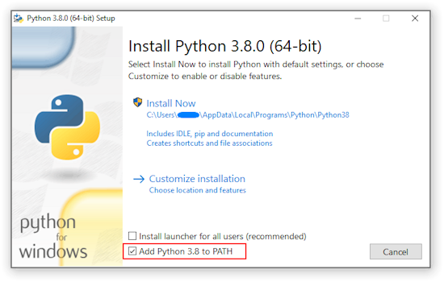

# RBLX Targeter

RBLX Targeter is a tool designed to identify whether a user is a Red Cell, Chimera, or Spectre target in the Roblox roleplaying game, **The Grand Crossing**. It leverages the [Users](https://users.roblox.com/docs/index.html) and [Groups](https://groups.roblox.com/docs/index.html) web APIs to perform its checks.

# Table of Contents

- [Contributors](#contributors)
- [Using the Tool](#using-the-tool)
- [Updating the Tool](#updating-the-tool)
- [Output Sample](#output-sample)

## Contributors

## Contributors

<table>
  <tr>
    <td style="text-align: center;">
      <a href="https://www.roblox.com/users/291119265/profile">
        
      </a>
      <br>
      <strong>Gr8P0tat0</strong>
    </td>
  </tr>
</table>

## Using the Tool

### Installation Guide

First, make sure you have Python installed on your system. I made this in version `3.12.3`, but Python is backward compatible, so any version later than that will work. 

You can download [the latest version of Python on their website](https://www.python.org/downloads/).

> [!NOTE]
> Make sure you check off the PATH option, as shown in the image below.



You will also need to install the Python `requests` package to use RBLX Targeter. This can be done by executing the command `pip install requests` in the terminal (Command Prompt, PowerShell, MacOS Terminal, etc).

Once you've done that, find [the latest release](https://github.com/Gr8Potato/RBLX-Targeter/releases) and download the `targeter.py` file.

### Providing a Cookie

You can optionally provide a cookie to bypass Roblox's strict API limits. You can provide a `.ROBLOSECURITY` cookie during the program's runtime.

To find cookies for most Chrome/Chromium browsers, `F12/Ctrl + Shift + I > Application > Cookies > ...roblox.com...`.

> [!NOTE]
> You will need to get a new cookie each time you log out (i.e.: when the cookie expires). This includes `_|WARNING:-DO-NOT-SHARE...`

## Updating the Tool

I don’t plan to maintain this indefinitely, but you can easily keep it current by updating the users, groups, and role containers whenever the Spectre target board changes.

**In the meantime, it would help all of us if you pinged me in the [Spectres Discord](https://discord.gg/zkXy3HbTKZ) server whenever you see the target board change!**

## Output Sample
The program runs entirely from the terminal. The output may be slightly different as the project carries on. This is taken from RBLX Target v2.0.
```
========================================
Enter .ROBLOSECURITY cookie (or leave blank to skip):
========================================
Enter user: 
Enter user: Gr8P0tat0
----------------------------------------
Username: Gr8P0tat0, DisplayName: Gr8Potato, Id: 291119265
----------------------------------------
SPECTRES
XXXXXXXXXX

RED CELL
XXXXXXXXXX

CHIMERA
Nighthawk Commandos, Gr8P0tat0 | MUST BE IN MORPH!
========================================
Cooldown: 0 seconds remaining
========================================
Enter user: Ciphren
----------------------------------------
Username: Ciphren, DisplayName: Ciphren, Id: 68966801
----------------------------------------
SPECTRES
Nighthawk Manticore, Ciphren | Phantom Assigned
Nighthawk Manticore, Auxilior, Ciphren | Permanent Hit
Nighthawk Military Police: Cerberus, | C | Council, Ciphren | Permanent Hit
Nighthawk Imperial Peacekeeper Corps, Ciphren | Permanent Hit

RED CELL
Nighthawk Manticore, Ciphren
Nighthawk Imperial Peacekeeper Corps, Ciphren

CHIMERA
Nighthawk Military Police: Cerberus, Ciphren | MUST BE IN MORPH!
========================================
Enter user: nokia3310achi
----------------------------------------
Username: nokia3310achi, DisplayName: 1AzOrion_02XL, Id: 888267834
----------------------------------------
nokia3310achi is not in The Nighthawk Imperium. Not a target. Are you sure you typed the name in correctly?
========================================
Enter user: thisusersimplydoesnotexist
----------------------------------------
No exact match found for username: thisusersimplydoesnotexist
========================================
```

---

Yo dudes, Spectres is pretty chill. Maybe you could like, [join it or something](https://discord.gg/zkXy3HbTKZ).

[](https://www.roblox.com/groups/4236314/Red-Cell-Spectres)
